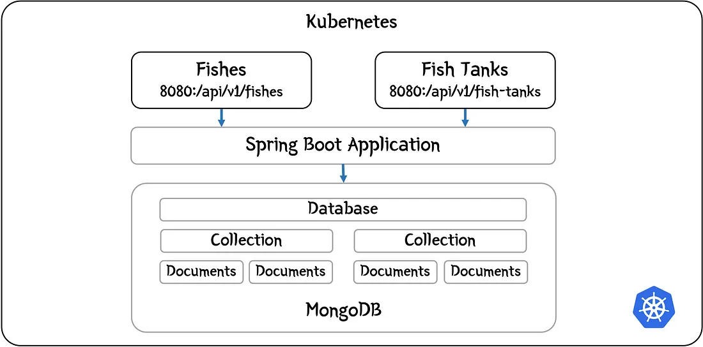
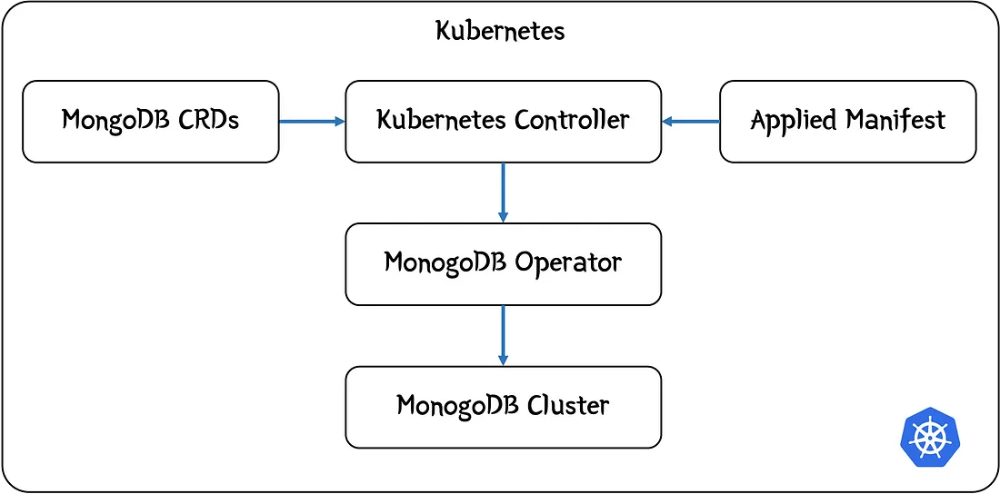

# 1. Architecture



# 2. Spin-up minikube-cluster.

## Step 1: Start the Minikube control-plane node
```
minikube start --cpus=2 --memory=2048 --profile=control-plane
```

## Step 2: Start the Minikube worker nodes
```
minikube start --cpus=1 --memory=1024 --profile=worker1
```

```
minikube start --cpus=1 --memory=1024 --profile=worker2
```

```
minikube start --cpus=1 --memory=1024 --profile=worker3
```

## Step 3: Configure kubectl to use the control-plane context
```
kubectl config use-context minikube
```

## Step 4: Verify the cluster nodes

```
kubectl get nodes
```

# 3. Installing MongoDB

- A Kubernetes operator manages an applica~tion on behalf of you.
- It is able to install and manage the lifecycle of the application whilst also monitoring it and taking action as necessary.
- In the case of a database, it could be creating a database cluster, scaling it, doing backups etc. Typically, an operator relies on installing Custom Resource Definitions (CRDs) that provide it with its own ‘Kubernetes configuration language’. 
- It listens out for requests to add these custom resources to the cluster and then acts on your behalf.



## a. Installing the operator

- First add the Helm link to your local repository with:

```
helm repo add mongodb https://mongodb.github.io/helm-charts
```
- You can see what charts this has added with:

```
helm search repo mongo
```
- We will place our operator and our database in their own separate namespace called mongo. Let’s create it with:
```
kubectl create namespace mongo
```